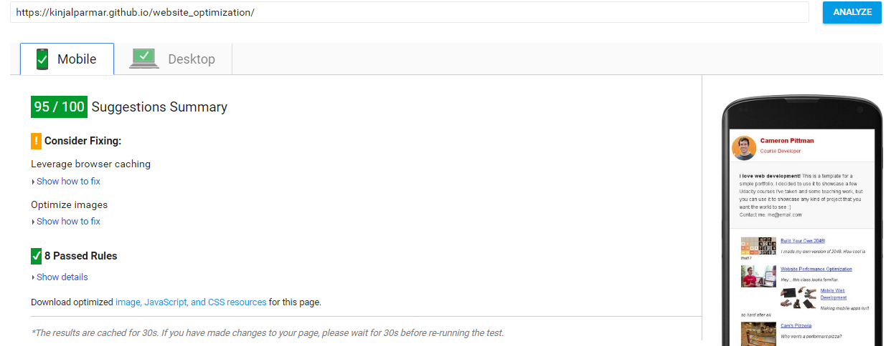

# Website Optimization

## Project Summary

This is the submission for Udacity's **Website Optimization** Project for the **Front-End Web Developer Nanodegree.** 

### How to run this application
1. Download this project or clone repository through Git. 
2. Open index.html in a web browser
You can also run it from : [kinjalparmar.github.io/website_optimization/](https://kinjalparmar.github.io/website_optimization/)

## Project Goal :

|Optimizations|Criteria|Goal|
|:-------------:|:-------------:|:-----:|
|Page Speed Score| Critical Rendering Path| For `index.html` achieves PageSpeed score of at least 90 for Mobile and Desktop.|
|Getting Rid of Jank| Frame Rate|Optimise `views/js/main.js` to make `views/pizza.html` render with a consistent frame-rate at 60fps when scrolling. |
|Getting Rid of Jank| Computational Efficiency|Time to resize pizzas is less than 5 ms using the pizza size slider on the `views/pizza.html` page.|

## Achieved Goals :
  
**1. PageSpeed Score** : `index.html` is optimized to achieved PageSpeed score of 95/100 for both mobile and desktop.
* Can check [my optimization score](https://kinjalparmar.github.io/website_optimization/) on : [Pagespeed Insights](https://developers.google.com/speed/pagespeed/insights/)

**2. Getting Rid of Jank** : `main.js` is optimized to achieve a frame rate of *60fps(Frame Rate per second)* when scrolling. Also reduced the time to resize pizzas in `pizza.html` to less than 5 ms.
* To review the `pizza.html` in view folder, open the file in your browser (Chrome is the most preferable) and check the console in the time line. You can see :
    - The time to generate pizzas
    - Average scripting time to generate last 10 frames
    - Average time to resize pizzas when slider is used

## Project folder information :

The project contains : Two main directories - `src` and `dist`, `index.html` file and `grunt` files. 

**`src` directory-** : Contains the source code. It has the following files and folders:
* `index.html`: unoptimized `html` file having low speed score.
* `css` and `views/css` folders contains the unminified `.css` files.
*  `js` folder contains the unuglified `.js` files.
*  `img` and `views/images` folders contains the original unoptimized images.
* `views/pizza.html` is optimized a little bit by adding minied `.css` and `.js` files.
* `views/js/main.js` is an optimized javascript file. It is optimized to obtain the second goal- getting rid of **Jank**.
* `index.html` : unoptimized `html` file having low speed score.
* `css` : contains the `.css` files necessary for styling the pages.
* `js` : contains the `.js` files.
* `img` : contains the original unoptimized images.
* `views`: The folder containing items for the second goal of the project.
    * `pizza.html` : It is the main file which is to be optimized with the help of `main.js` to get rid of jank. 
    * `css` : contains the `.css` files necessary for styling the pages.
    * `js` : optimized javascript file.
    * `images` : contains the original unoptimized images.
* `project-2048.html`, `project-mobile.html` and `project-webperf.html` are the other html files.

**`dist` directory-** : Contains the production code. It has the following files and folders:
* `dist` folder which is further divided into `css`, `images` and `js` folders which contains minified, uglified and compressed files obtained using grunt.

**Grunt Files :** `Gruntfile.js` and `package.json`

**`index.html`** is an optimized html file which is also the entry point of the project. It is optimized to obtain the **PageSpeed** goal.

## Using Grunt : If you are new to Grunt and want to run the grunt files for this project you need to follow the following steps:

1.**Install node.js :**  Download and follow the install instructions for node.js here: http://nodejs.org/
2.**Install grunt-cli (the Grunt command line interface):** grunt-cli docs: http://gruntjs.com/getting-started.
``` 
npm install -g grunt-cli 
```
3.You can either install each plugin individually from the command line but as we already have `package.json` file simpy do the following:
```
npm install 
```
4.**Run Grunt :**
We already have Gruntgile.js so the last thing we need to do is run Grunt. From the command line `cd` to the root directory of the project and run grunt:
```
grunt
```
The work is done inside the src folder and Grunt will minify/uglify/compress all those files and save them into the dist folders.

> **Note :** `index.html` and `pizza-min.png` are the two files which are further modified and compressed. You need to see **Optimization Details** of this **READEME** for more details.

## Optimization Details :

To achieve the goal, I have made the following optimizations :

**Page Speed Optimizations :**
* **Removed Render Blocking CSS** : 
    - Used `grunt-critical` to find the minimum set of blocking CSS, or the critical CSS and inline it inside `index.html`.
    - Added `media="print"` attribute to the `css/print.css` file so it would  only load if printing.
* Put the `<script></script>` at the bottom of `body` element.
* Optimized Google fonts by adding the WebFont Config Script.
* Added `async` attribute to two `.js` files so they would load asynchronously.
* Used **Grunt** to :
    - minify `.css`
    - uglify `.js`
    - compress images
* Further reduced the size of `pizzeria-100small.jpg` using [http://optimizilla.com/](http://optimizilla.com/) and rename it as : `pizzeria_min.jpg`.
* Screenshot of PageSpeed test:



**Achieving 60 fps in the pizza.html page** 

* **Change CSS** for `.mover` : 
    * Add `transform: translateZ(0)`, `will-change: transform`, `transform translate3d(0,0,0)` and `backface-visibility: hidden`.
* Deleted the determineDx function as it creates a lot of work and was creating forced synchronous layout. 
* Removed the `sizeSwitcher()` function and add the sizing `switch` case inside the `changePizzaSizes()` function which sets the percentage width required according to changes in sliding bar.
* Declared the variables outside the loop to reduce loop complexity.
* Declared the variables querying the DOM everytime outside the loop. 
* Use *getElementByID* and *getElementsByClassName* instead of *querySelector* and *querySelectorALL* to increase scroll and page rendering..
* Made phase for sin wave an array `phase_array`to do 5 calculations once and then use it in for loop.
* Precalculate the variable `scr` to reduce activity in the loop
* Used `TranslateX` instead of `basicLeft` to repositioned pizzas.
* Have made some changes according to the discussions in the forum.
* Used `ticking` to make sure the updatePositions function isn't firing unnecessarily.
* Reduced pizzas from 200 to a dynamically calculated value using viewport height.
* Move `items` at the bottom of the page to stop updatePositions from re-defining items on every scroll event.

### Try to further optimize it :wink:


